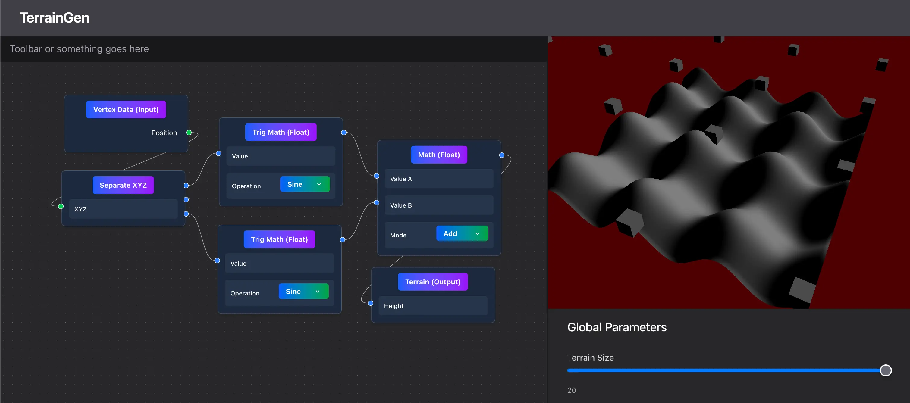

# TerrainGen

_Final project for CIS5650_



[Link to website! ](https://thumun.github.io/TerrainGen/)

## Motivation

This is a single-page web application using WebGPU to create a real-time node-based procedural terrain generation tool.

### Milestones

1. [Milestone 1 Progress Slides](https://docs.google.com/presentation/d/1IfnNaKhCkMEOW8t8lHOAx6w-G378lC401EXVFlAbnQ0/edit?usp=sharing)
2. [Milestone 2 Progress Slides](https://docs.google.com/presentation/d/1EiJf1spHf-v6SMP9DFZE5cckQX3vl9SmCcZ-_3t7WVw/edit?usp=sharing)
3. [Milestone 3 Progress Slides](https://docs.google.com/presentation/d/1SY8XgbtOQOwFCNqlIhqCft3_o6H0uVIyBBi3s_v93jw/edit?usp=sharing)

## Project Details 

TerrainGen is a easy-to-use procedural, node-based tool that users can utilize to create terrain! Our project is entirely on WebGPU so the user does not have to worry about any setup/download issues.

### Window Layout 


Nodes can be added to the canvas element on the left-hand side of the screen and will be renderer on the right side window when the output nodes have the appropriate inputs. The terrain has two additional settings that can be adjusted with the terrain size and resolution sliders below the render screen.

### Import/Export 


A user can import/export their node graph.

As an example, here is a saved node graph layout [file](https://github.com/user-attachments/files/23843108/nodegraph-692ce3b8.tgen.json).
If this is imported, then the following node graph will be loaded in.


### Input Nodes

#### Vertex Data
This node outputs the position of the verticies. Nodes connected to this one can be used to offset these positions.


#### Geometry 
These nodes all work the same functionally. In that, they load a chosen model based on user input after connected to the **instancing (output)** node.
| |  |  |
-------------------------- | -------------------------- | -------------------------- |
A user can add primitive geometry with this node (cube, sphere, plane) | A user can load their personal models with this node (only OBJ is supported for the time being) | A user can choose between our custom built-in geometry (ex. trees, rocks) to add to the terrain rather than upload their own |

#### Float 
This node allows for an input float variable.


#### Vector
This node allows for an input vec3f variable.


#### Unsigned Int
This node allows for an input unsigned int variable.


### Utility Nodes

| Separate XYZ | Combine XYZ |
-------------------------- | -------------------------- |
 |  |
| This node separates an input of type vec3f to three floats (x, y, z) | This node combines three float inputs into one vec3f |

### Geometry Nodes 

-- Will be added --

### Operator Nodes 

### Math 

| Math | Trig Math | Mix |
-------------------------- | -------------------------- | -------------------------- |
 |  |  |
| This node can be used to apply one of the following operations (add, subtract, multiply, divide) to two inputs (float or vec3f) and returns a value of the same type | This node applies a trig function to an input value and returns a float output | This node linearly interporaltes between the two input values based on the mix value |

### Noise 
-- Will be added --

### Output Nodes

| Terrain | Instancing |
-------------------------- | -------------------------- |
 |  |
| This node triggers the terrain pipeline if the height float input is connected to a valid node. | This node triggers the instancing pipeline. The pipeline is only run/rerun if both the scatter and geometry inputs are connected to valid nodes. |

### Feature checklist

- [x] 🔌 Node-based description system for procedural terrain
- [x] 🏭 Just-in-time WebGPU shader code generation
- [x] 🏔️ Real-time terrain rendering
  - [x] Adjustable tesselation and terrain size
  - [ ] Varied terrain type rendering (grass, rock, snow, etc)
- [ ] 🔎 Real-time in-editor node previews
- [x] 🌲 Mesh instancing across terrain
  - [x] Mesh import for instancing
- [ ] 💾 Export to glTF or similar format

#### Node types:

- General-purpose
  - [x] Basic math (add, sub, mult, div)
  - [x] Trig math (sin, cos, tan)
  - [ ] Masking/graphics util (mix, lt, gt, min, max)
- Terrain source
  - [ ] Perlin noise
  - [ ] Custom image texture
- Terrain input
  - [x] Vertex XYZ position
- Terrain output
  - [x] Height
  - [ ] Terrain type
- Scattering source
  - [x] Terrain height
  - [ ] Voronoi scattering
- Scattering geometry
  - [x] Built-in objects: trees, rocks, bushes
  - [x] Primitive geometry: sphere, cube, plane, line
  - Custom models
    - [x] OBJ import
    - [ ] glTF import
  - [ ] Vegetation → like Unreal’s PCG

## Development

To run this application:

```bash
npm install
npm run dev
```

### Building For Production

To build this application for production:

```bash
npm run build
```

The resulting static content will be in the `dist` folder. You can preview these with `npm run preview`.

We have created a GitHub Actions workflow (`.github/workflows/deploy.yml`) to automatically deploy static content to GitHub Pages.

### Testing

This project uses [Vitest](https://vitest.dev/) for testing. You can run the tests with:

```bash
npm run test
```

### Linting & Formatting

This project uses [eslint](https://eslint.org/) and [prettier](https://prettier.io/) for linting and formatting. Eslint is configured using [tanstack/eslint-config](https://tanstack.com/config/latest/docs/eslint). The following scripts are available:

```bash
npm run typecheck  # just runs tsc
npm run lint
npm run lint:fix  # automatically fix issues
npm run format
npm run format:check  # don't write to any files, just report issues
```

## Third-party libraries

- [Tailwind CSS](https://tailwindcss.com/) for styling.
- [React](https://react.dev/) for DOM manipulation
- [TanStack Router](https://tanstack.com/router). The initial setup is a code based router. Which means that the routes are defined in code (in the `./src/main.tsx` file). If you like you can also use a file based routing setup by following the [File Based Routing](https://tanstack.com/router/latest/docs/framework/react/guide/file-based-routing) guide.
- [React Flow](https://reactflow.dev/) for node editor functionality
- [loaders.gl](https://loaders.gl/) for reading/writing of external files
